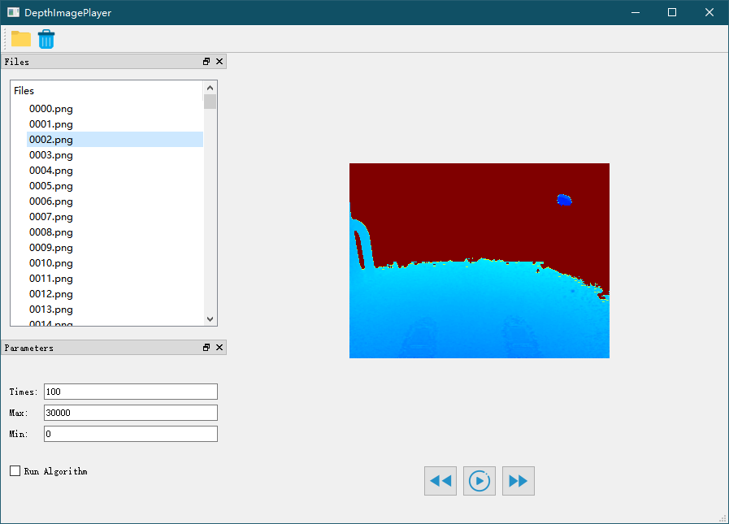
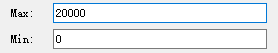
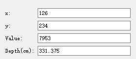

# DepthImagePlayer

## Description
目前很多深度图像以无符号16位存储，系统自带的查看工具看到多是纯黑或细节不明显图像，为了方便查看深度图像，提高开发效率，开发此工具。  
基于Qt的深度图像播放器，方便采集后快速回看图像。  
**目前仅支持CV_16U图像读取**。  
  
## Software
Windows 10  
Visual Studio 2013  
OpenCV 2.4.13  64bit  
Qt 5.7.0  64bit  

## Compiling
**（仅测试windows）**
* 复制opencv2.4.13环境文件到工程目录下，debug/release分别命名为：OpenCV2.4_Win64_Debug.props和OpenCV2.4_Win64_Release.props（更高版本应该也支持，但没有测试）  
* 用vs打开工程（我们使用VS 2013）  
* 解决方案平台选择x64（如果没有请创建）  
* QT VS TOOLS->Qt Project Settings，设置Qt版本（仅测试了Qt 5.7.0）  
* 编译  

## Summary 

  
### 1. 加载图片  
点击 按钮，选择图片存放的文件夹，在Files文件树中即可看到当前文件夹下所有png图片。  
双击文件树中的文件元素，即可在图像区看到经过伪彩色染色后的深度图像。  
点击 按钮，可以清空文件树。  

### 2. 伪彩色染色
在可以设置伪彩色范围，设置最大值和最小值区间越小图像细节越丰富。  

### 3. 查看图像数据
在图像上单击左键可以查看当前点的像素坐标、数值和对应的深度距离。  
这里数值和深度的转换公式是 depth = value * 1250 / 30000。  
 

### 4. 图片播放
#### 上一张
点击 按钮可以切换到上一张图像。  
#### 下一张
点击 按钮可以切换到下一张图像。  
#### 播放
点击 按钮可以自动加载下一张图像；  
点击 按钮可以暂停播放。  
可以设置每张图片加载的间隔时间。  
**如果没有启用算法或图片读取速度较快，建议间隔时间不要设置太小**

### 5. 算法模块
为了方便验证算法，可以在源码合适位置添加算法模块，勾选启用算法模块，将计算结果显示到窗口。

# Plane
* 快速文件重命名工具。  
* 大量图片分段加载。   
* 语言切换功能。  

# Version

